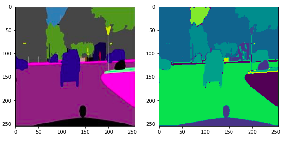
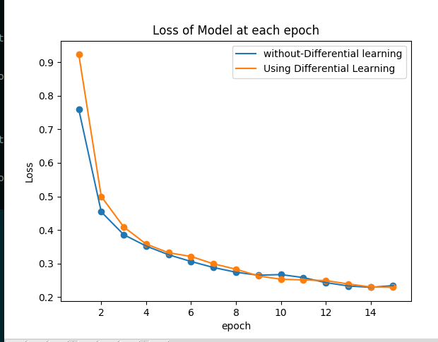

Overview
=======
We have to do Semantic Segmentation for the Cityscape dataset and for that we are using U-net Architecture with Resnet-18 as the Encoder part. In this we are implementing Differential learning rate for the model by grouping it into different parts.

---
Preprocessing Data
---
After splitting the dataset as image and labels,we are using K-means Clustering algorithm to classify each Pixel to their respective classes. By this we are converting 3 - channel image to a single channel image which will be easier to train also.

Differential Learning
---
In this we are grouping the Model as two parts the Encoder and the rest of the model.Since the encoder is a pretrained Resnet-18 we are giving a low learning rate than the rest.

---

Comparing results before and after Differential learning
---

