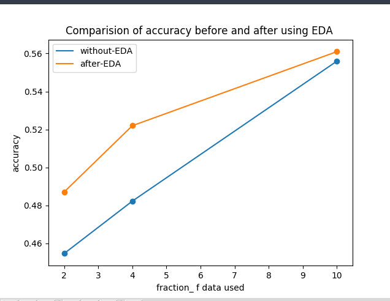

Sentiment analysis using DistilBERT on Yelp reviews - Full and analysing the performance after applying the EDA.
=======

Preprocessing Data
-----------
To tokenize the sentences and to get Id of eack token we are using DistilBertTokenizer from Transformers library.

---
Model
-------
We are using DistilBERT transformer model and loading pretrained weights of bert-base-uncased.

---
EDA Implementation
--------
Data Augmentation used are:

    * Random Deletion
    * Random Swap
    * Random Insertion
    * Synonym Replacement

Code for data augmentation is used from [here](https://github.com/jasonwei20/eda_nlp).Which is an implementation of this [paper](https://arxiv.org/pdf/1901.11196.pdf)

---
Comparing Results befor and after EDA:
---
---
Due to Computational restriction we are using only 6500 reviews from Yelp Review -Full and trained using 20 % ,40 % and 100 % of this dataset.

From the graph it is clear that accuracy is increased after EDA but increase in accuracy is slowly dies out when dataset is huge.

